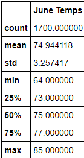
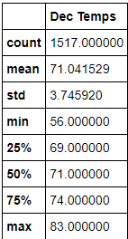

# Surfs Up

## Resources 
Jupyter notebook, Python, Visual Code Studio, SQLite
Dependencies: Pandas, Numpy, SQLAlchemy

Challenge Code: [SurfsUpChallenge.ipynb](SurfsUp_Challenge.ipynb)

SQLite File: [hawaii.sqlite](hawaii.sqlite)

## Description
W. Avy requests temperature data for the months of June and December in Oahu to determine if the surf and ice cream, shop business is sustainable year-round. 
Analysis of the data was performed to isolate the temperature from the months of June and December respectively. The summary statistics was then used to further analyze the data retrieved. 

## Results 

* From the summary statistics determined from the June and December temperatures, it is observed June has higher temperatures than December. June has a higher mean temperature of 74.9 while Dec has a mean temperature of 71.0. 
* The temperature through June can range between 64 at it's lowest temperature and 85 at it's highest temperature. This is a temperature difference of 21 degrees. For December, the temperature can range from a minimum of 56 to a maximum of 83. This is a temperature difference of 27 degrees. 
* Additionally, this is congruent with the standard deviation results we observe where June has a standard deviation of 3.26 while December has a standard deviation of 3.74.

 

## Summary 

Based on the temperature alone, although it is observed that June is warmer than December temperatures, they are relatively similar and only differ by a couple degrees. This temperature difference should not have a large impact on the surfing and ice cream business. Therefore, more analysis must be performed to ensure W. Avy is making an informed decision in favour of the surf and ice cream shop. The precipitation occurring at both months should also be observed. If there is significantly more precipitation in December versus June, then even though the temperature is similar, business will still be slow as less people will surf and buy ice cream during rain. Another analysis that could occur is whether the number of stations collecting this information for June and December. This will determine if there is sufficient information being collected from a number of stations to find the data credible. Lastly, additional months should be observed like March and September. The analysis of March and September will allow us to observe the temperatures and precipitation values for every season throughout the year. 
